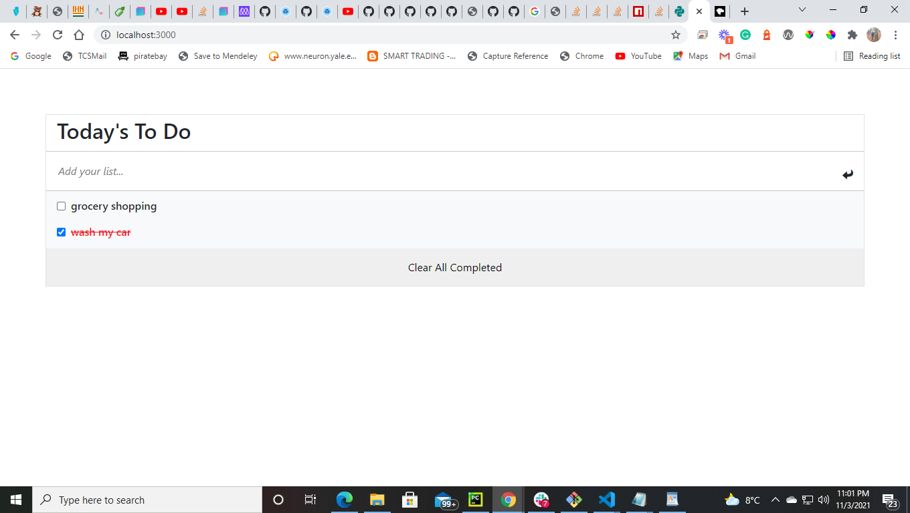

# To Do List: List Structure

> In this project I created a simple to-do-list using JavaScript and Webpack. I have implemented, add, remove and update functions using javascript.

Additional description about the project and its features.

## Built With

- HTML, CSS, JavaScript
- Webpack, Javascript
- Visual Studio

## Live Demo

[Live Demo Link](https://medini-rajendra.github.io/Webpack-Project/)

## Getting Started

**This is an example of how you may give instructions on setting up your project locally.**
**Modify this file to match your project, remove sections that don't apply. For example: delete the testing section if the currect project doesn't require testing.**

## Authors

👤 **Rajendra Medini**

- GitHub: [@githubhandle](https://github.com/Medini-Rajendra/)
- Twitter: [@invenire512](https://twitter.com/invenire512)
- LinkedIn: [LinkedIn](https://www.linkedin.com/in/medinichaitanya/)

## 🤝 Contributing

Contributions, issues, and feature requests are welcome!

Feel free to check the [issues page](../../issues/).

## Show your support

Give a ⭐️ if you like this project!

## Acknowledgments

- Hat tip to anyone whose code was used
- Inspiration
- etc

## 📝 License

This project is [MIT](./MIT.md) licensed.
